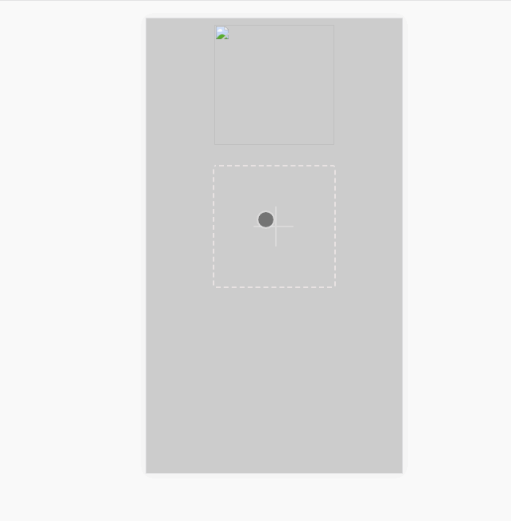

# vue-cropper


> A Vue.js project, 解决移动端上传图片压缩和提供裁剪功能
依赖：[cropperjs](https://github.com/fengyuanchen/cropperjs)
[localResizeImg](https://github.com/think2011/localResizeIMG)

##### 使用方法
1、在vue的main.js引入clipper.js
```
import clipper from '/path/to/clipper.js'
Vue.use(clipper)
```
2、在index.html引入clipper.css样式表
```
<link rel="stylesheet" href="/path/to/clipper.css">
```
3、组件中调用clip方法, targetObj是裁剪后显示图像的dom, aspectRatio是裁剪的比例
```
upload (event) {
  let targetObj = document.getElementById('target')
  this.clip(event, {
    resultObj: targetObj,
    aspectRatio: 1
  })
}
```
4、在App.vue中有例子
